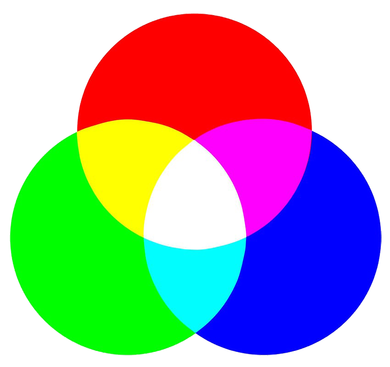
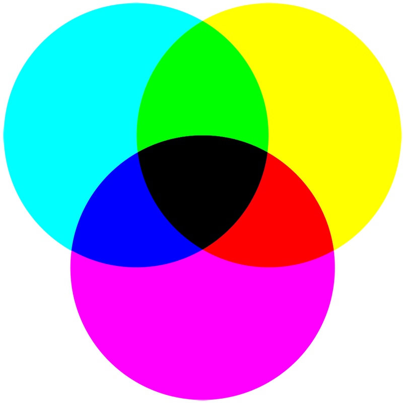

Chào các bạn, mình sẽ tiếp tục với series của [khái niệm màu sắc trong thiết kế](https://congnghevacuocsong.tk/khai-niem-mau-sac-trong-thiet-ke-p1) phần 2.

<h3 style="font-weight: bold;">Tìm hiểu các hệ màu trong thiết kế</h3>
<h1 style="text-align: center;">RGB</h1>

RGB - viết tắt (<label style="color: red;">Red</label>, <label style="color: green;">Green</label>, <label style="color: blue;">Blue</label>) được biết đến 3 màu gốc trong mô hình màu ánh sáng bổ sung, là một hệ thống màu cộng. Nếu kết hợp 3 màu này với nhau sẽ ra màu trắng <canvas width="10" height="10" style="background: #fff; border: 1px solid #000;"></canvas> #FFFF.

(Mã hex bao gồm: <canvas width="12" height="12" style="background: #FF0000;"></canvas>-#FF0000, <canvas width="12" height="12" style="background: #00FF00;"></canvas>-#00FF00, <canvas width="12" height="12" style="background: #0000FF;"></canvas>-#0000FF).

<h1 style="text-align: center;">RGBA</h1>

RGB - viết tắt (<label style="color: red;">Red</label>, <label style="color: green;">Green</label>, <label style="color: blue;">Blue</label>, <label style="background-color: rgba(0, 0, 0, 0.2);">Alpha</label>), phần mở rộng của giá trị màu (**`RGB`** với phần bổ sung là **`opacity`** được quy định độ trong suốt của màu sắc. **`Alpha`** có giá trị từ 0.0 - 1.0)

<article>
	
	
<canvas class="rgba-color"></canvas>

</article>

<h1 style="text-align: center;">CMYK (in ấn)</h1>

CMYK - viết tắt (<label style="color: #00ffff;">Cyan</label>, <label style="color: #FF00FF;">Megenta</label>, <label style="color: #FFFF00;">Yellow</label>, <label style="color: #000;">Key</label>), một hệ thống màu trừ, ngược với RGB. Hệ thống làm việc trên hệ màu này dựa trên cơ sở hấp thụ ánh sáng. Nếu kết hợp 3 màu này với nhau sẽ ra màu đen (<canvas width="12" height="12" style="background-color: #000;"></canvas> #000000).

(Mã hex bao gồm: <canvas width="12" height="12" style="background-color: #00FFFF;"></canvas>-#00FFFF, <canvas width="12" height="12" style="background-color: #FF00FF;"></canvas>-#FF00FF, <canvas width="12" height="12" style="background-color: #FFFF00;"></canvas>-#FFFF00).

Màu đen (<canvas width="12" height="12" style="background-color: #000000;"></canvas> #000000) là màu không phản chiếu ánh sáng, trong khoa học, màu đen không phải là màu sắc

Cảm ơn các bạn đã xem qua hi vọng các bạn thích post này của mình và đừng quên like và share cho mình, để mình có động lực tổng hợp đăng những bài học hữu ích về công nghệ nhé !. Mình sẽ tiếp tục series này trong phần 3 của bài `Tìm hiểu các hệ màu trong thiết kế`.
