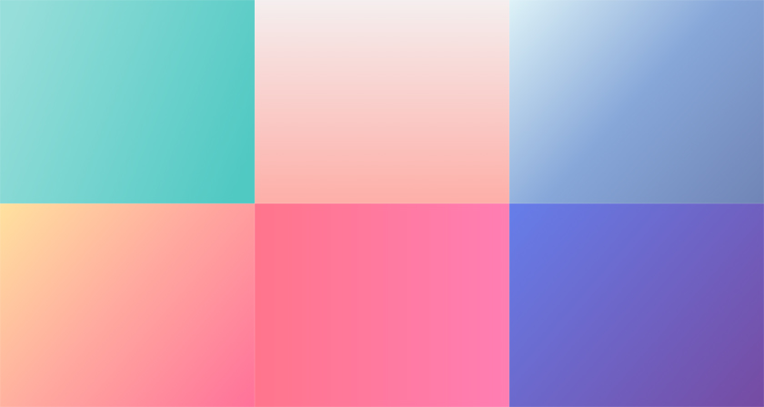
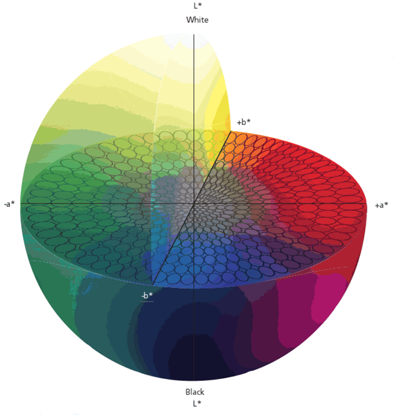
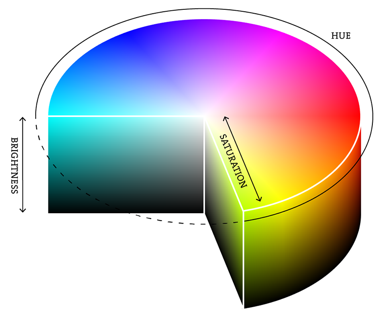
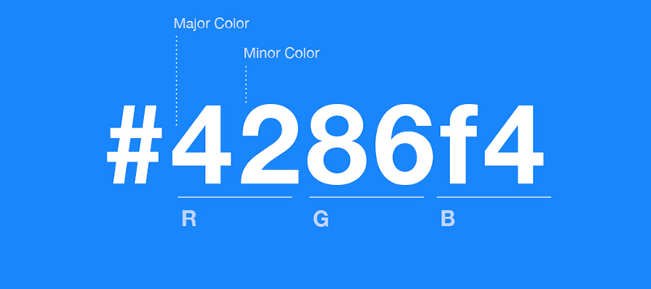

Chào các bạn, mình sẽ tiếp tục với series của Khái niệm màu sắc trong thiết kế (phần 3

<h1 style="text-align: center;">LAB</h1>

Lab - viết tắt **`Lightness-Luminance`** trong đó:

(L) là trục thẳng đứng, chỉ biểu diễn độ sáng có giá trị từ 0 (#000000) đến 100 (#FFFFFF)
(-a) đến (a): chứa giá trị màu GREEN - (#00FF00) đến RED + (#FF0000)
(-b) đến (b): chứa giá trị màu BLUE - (#0000FF) đến YELLOW + (#FFFF00).

Các thông tin màu được tách ra được dùng trong các filter của Photoshop, không làm ảnh hưởng đến màu sắc trong bức ảnh.

<h1 style="text-align: center;">HSB</h1>

HSB hoặc V - viết tắt **`Hue - Saturation - Bright/Value`** trong đó:

(Hue): Liên quan đến dải màu đỏ - cam - vàng - lục - lam - chàm - tím. Được biểu diễn có giá trị từ 0° đến 360°
(Saturation): Liên quan đến sắc độ, có giá trị từ 0% đến 100%
(Bright/Value): Độ sáng - tối, có giá trị từ 0% đến 100

<h1 style="text-align: center;">HEX</h1>

HEX - viết tắt **`Hexadecimal`**, hệ thống màu biểu diễn giá trị màu sắc RGB dưới dạng thập lục phân, một chuỗi bao gồm 6 chữ hoặc số dạng ghép của 3 số dạng một byte. Mỗi byte đại diện cho một số trong khoảng 00 - FF tức 0 - 255 trong hệ thập phân.

Cảm ơn các bạn đã ghé qua blog của mình, đừng quên ấn nút share để bạn bè cùng biết đến nhé !

[khái niệm màu sắc trong thiết kế Phần 1](https://congnghevacuocsong.tk/khai-niem-mau-sac-trong-thiet-ke-p1)
[khái niệm màu sắc trong thiết kế Phần 2](https://congnghevacuocsong.tk/khai-niem-mau-sac-trong-thiet-ke-p2)
