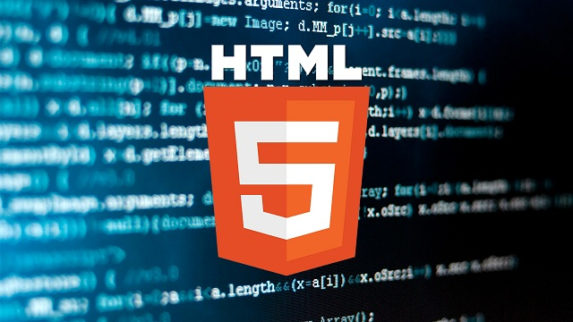

Trong vài năm qua, bạn có thể đã nghe người ta nói nhiều về HTML5. Cho dù bạn biết mọi thứ về phát triển web hay không, thì khái niệm này có thể hơi mơ hồ và khó hiểu đối với bạn. Rõ ràng, nó là bước tiếp theo trong quá trình phát triển của HTML, nhưng chính xác nó để làm gì? Tại sao lại có quá nhiều sự hào hứng xung quanh nó? Và tại sao nó lại quan trọng đối với bạn?

HTML hay HyperText Markup Language, là thành phần quan trọng nhất của World Wide Web. Nó là ngôn ngữ dùng để mô tả những gì một trang web hiển thị. Tuy nhiên, nếu chỉ riêng HTML thôi thì khá nhàm chán bởi vì nó chỉ có thể cung cấp các trang web tĩnh; nhằm đáp ứng nhu cầu ngày càng tăng về các tính năng web ấn tượng hơn, HTML đã được kết hợp với các plugin như CSS, Flash, Java, Silverlight, v.v…

Nó đã trở thành một cái gì đó khá cồng kềnh và các trình duyệt khác nhau thực hiện những tính năng theo cách riêng của chúng. HTML5 sinh ra để giải quyết những vấn đề lớn của HTML, giúp cho trang web trở nên rõ ràng và hiệu quả hơn.

Tại TechMaster có khóa học [Web cơ bản HTML5, CSS3 và Javascript](https://techmaster.vn/khoa-hoc/25487/web-co-ban-html5-css3-va-javascript) dành cho người mới bắt đầu, chưa học lập trình hoặc cho những ai muốn ôn lại kiến thức căn bản về lập trình web.

**HTML: Một cái nhìn tổng quan**

HTML như chúng ta biết hiện nay được gọi là HTML4 và nó đã được xuất bản lần đầu vào năm 1997. Vâng, điều đó có nghĩa là chúng ta đã sử dụng HTML4 trong hơn 15 năm nay, và đó là một khoảng thời gian rất dài trong lĩnh vực công nghệ. Khoảng năm 2000, một ngôn ngữ đánh dấu được gọi là XHTML bắt đầu được phát triển song song và nó đã được sử dụng khá tốt trong những năm qua, chủ yếu là do các tiêu chuẩn khắt khe mà nó áp đặt. Nhìn chung, mặc dù, hai ngôn ngữ này là tương tự nhau.

Vấn đề đối với HTML4 là các chức năng của nó rất giới hạn. Nó phải được mở rộng thông qua các plugin như Flash, để cung cấp nhiều tính năng trên text (văn bản) và hình ảnh đơn giản hơn. Ví dụ, nhiều video player đã được tạo ra và duy trì trên nền tảng Flash và nhúng vào các trang HTML. Nhiều ứng dụng web được phát triển sử dụng Java và các applet nhúng vào web.

Với tất cả các plugin này, nó trở nên khó khăn trong việc duy trì các tiêu chuẩn thích hợp. Lý tưởng nhất, mọi trình duyệt sẽ hiển thị các trang web theo cùng một cách để cung cấp những trải nghiệm tương tự cho mỗi người dùng. Để hiển thị kết quả tương tự trên nhiều trình duyệt, các lập trình viên web thường cần phải thực hiện những sửa chữa nhanh và áp dụng những mẹo vặt trong các phần khác nhau của trang web của họ để thích nghi với các quá trình rendering khác nhau. Điều này sẽ làm cho trang web trở nên cồng kềnh sau một thời gian ngắn.

Trên một lưu ý thực tế hơn, các trang web yêu cầu các plugin như Flash và Java cuối cùng sẽ sử dụng nhiều CPU và RAM hơn. Bạn đã bao giờ tự hỏi tại sao trình duyệt của mình lại sử dụng quá nhiều tài nguyên của máy tính đến như vậy? Rất nhiều trong số đó có thể xuất phát từ các phần mở rộng HTML. Đây là một trong những lý do tại sao Apple đã không hỗ trợ Flash trên các thiết bị di động của họ (để tiết kiệm pin).

**Vậy chính xác HTML5 là gì?**

Cụ thể hơn, HTML5 đã bổ sung thêm rất nhiều các thẻ đánh dấu (markup) mới:

**Các thẻ `<header>` và `<footer>` :**
giúp bạn tách các phần trên và dưới của các block nội dung. Để có thể sử dụng nhiều lần trên một trang duy nhất.

**Thẻ `<article>` :**
Giúp xác định một phần cụ thể về nội dung, ví dụ, một bài blog hoặc một bình luận của độc giả.

**Thẻ `<nav>`:** 
Để xác định những phần nào được coi là khối điều hướng.

**Thẻ `<section>` :** 
Cho phép bạn xác định một phần nội dung nào đó; tương tự như các thẻ `
` hiện nay.

**Các thẻ `<audio>` và `<video>` :**
Để đánh dấu những nội dung bao gồm âm thanh hoặc video.

**Thẻ `<canvas>` :**
Cho phép bạn vẽ đồ họa sử dụng một ngôn ngữ kịch bản riêng biệt.

**Thẻ `<embed>` :**
Dùng để nhúng các nội dung hoặc các ứng dụng bên ngoài vào trang web.

HTML5 cũng bỏ đi một số thẻ: **`<acronym>`, `<applet>`, ``, `<frame>`, `<frameset>`, `<noframes>`**, và một số thẻ khác.

Các tiêu chuẩn đặc tả kỹ thuật đầy đủ cho HTML5 đã được lên kế hoạch hoàn thành từ năm 2014, nhưng HTML5 đã có nhiều tiến bộ đã và nó có thể được sử dụng để thực hiện các tính năng cho đến hiện nay. Các tiêu chuẩn đặc tả kỹ thuật đầy đủ cho HTML5.1 dự kiến ​​sẽ được hoàn thành vào năm 2016.

**Tại sao HTML5 lại quan trọng đối với bạn**

Là một người sử dụng web, bạn sẽ được hưởng lợi từ HTML5 bởi vì nó đã sửa chữa những vấn đề hay gặp phải trong HTML4. Các trang web sẽ có những tiêu chuẩn web tốt hơn, giúp cho việc hiển thị nội dung hiệu quả hơn và cải thiện hiệu suất. Khi HTML5 được phổ biến trên diện rộng, các trang web sẽ có tốc độ tải nhanh hơn, băng thông sử dụng ít hơn, và tuổi thọ pin của các thiết bị di động sẽ được kéo dài hơn.

Thêm vào đó, bạn sẽ không cần phải luôn để ý đến các bản cập nhật của các plugin như Flash và Java. Tôi rất ghét việc phải liên tục cập nhật rất nhiều addons và plugins trên nhiều trình duyệt. Và điều gì sẽ xảy ra khi một trong số chúng có phiên bản không phù hợp? Các trang web sẽ ngừng hoạt động và mang lại nhiều nỗi thất vọng. Tất cả điều đó sẽ được giải quyết ngay khi HTML5 trở thành tiêu chuẩn chính.

Nếu bạn chỉ là một người sử dụng web bình thường và bạn không có ý định viết code hoặc tạo ra trang web của riêng mình, thì bạn không cần phải làm bất cứ điều gì để được hưởng những tính năng tuyệt vời của HTML5. Tất cả các trình duyệt phổ biến hiện nay đều đã hỗ trợ HTML5 ở một mức độ nào đó và bạn có thể đã sử dụng nó mà không biết. Chỉ cần giữ cho trình duyệt của mình luôn cập nhật và bạn sẽ cảm nhận được những tính năng mới.

Và nếu bạn là một nhà phát triển web, HTML5 sẽ làm cho mọi thứ đơn giản và dễ dàng hơn cho bạn. Nếu mọi việc suôn sẻ, bạn sẽ không phải vật lộn với các vấn đề trong thiết kế web như ở phiên bản HTML cũ, vì tất cả các trình duyệt sẽ cần phải tuân thủ cùng một bộ tiêu chuẩn mới.

**Kết luận**

HTML5 là tương lai của trình duyệt web và nó chắc chắn sẽ cách mạng hóa cách chúng ta lướt web. Thậm chí dưới những hạn chế của HTML4, các lập trình viên cũng đã tạo ra một số trang web rất tuyệt vời, vì vậy sẽ rất thú vị để xem những gì sắp được thực hiện với các chức năng của HTML5.

Hy vọng rằng giờ đây bạn đã có thể nhìn thấy HTML5 một cách rõ ràng hơn và biết tại sao nó lại được thổi phồng lên nhiều đến như vậy. Nếu bạn có bất kỳ câu hỏi nào, xin hãy để lại ý kiến trong phần bình luận phía dưới nhé!

Nguồn: [techmaster.vn](https://techmaster.vn/posts/33804/html5-la-gi-hoc-lap-trinh-web-co-ban-den-nang-cao?fbclid=IwAR06lAmlmuthMOeGKTpoZgLDTOCMJLI02j_ftRBWmUgLqzJHpinSCOGtJw4#toc-html-m-t-c-i-nh-n-t-ng-quan)