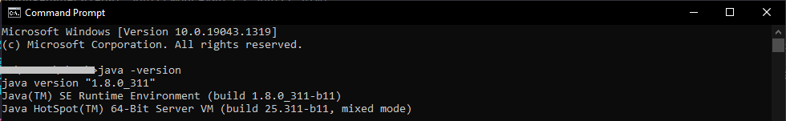
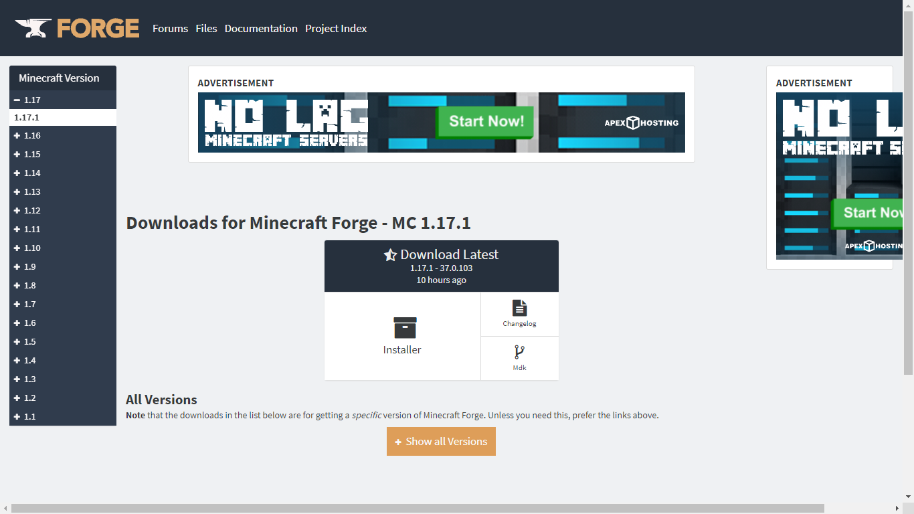
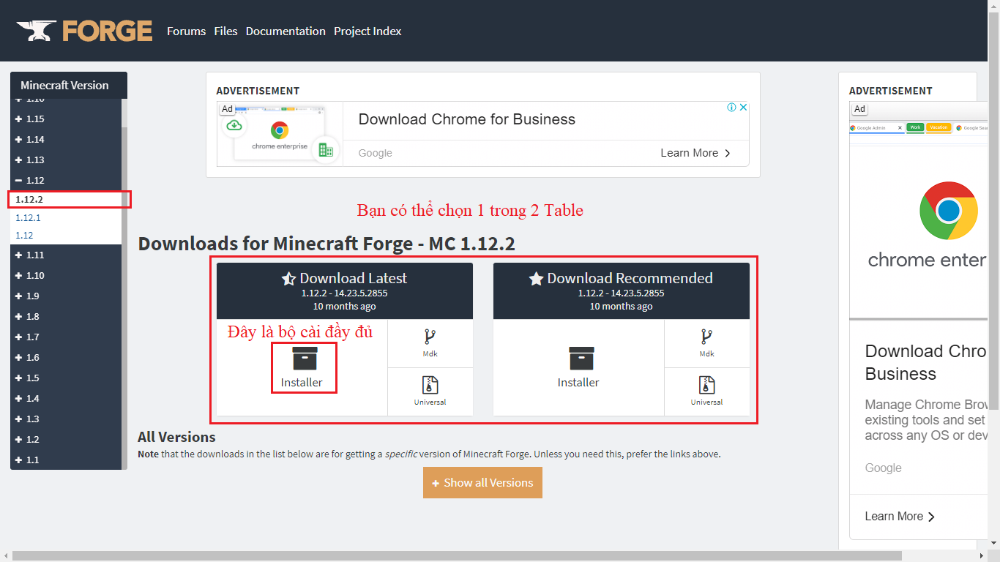
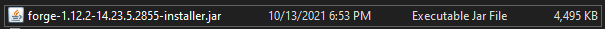
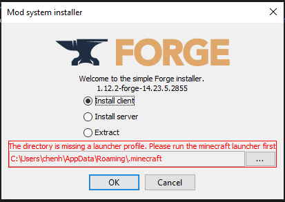
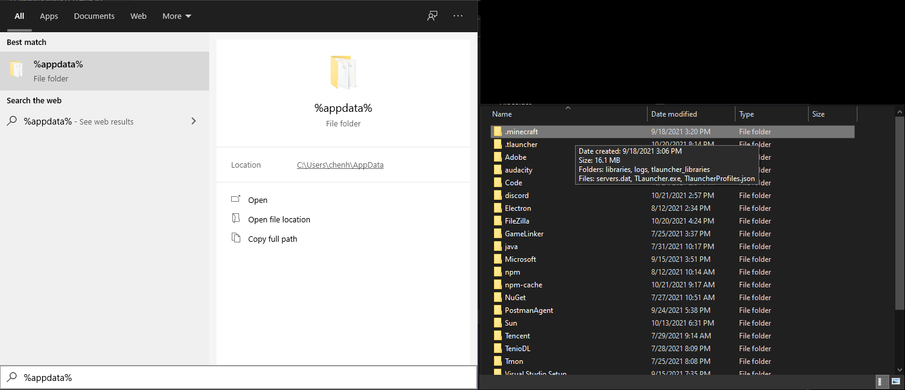
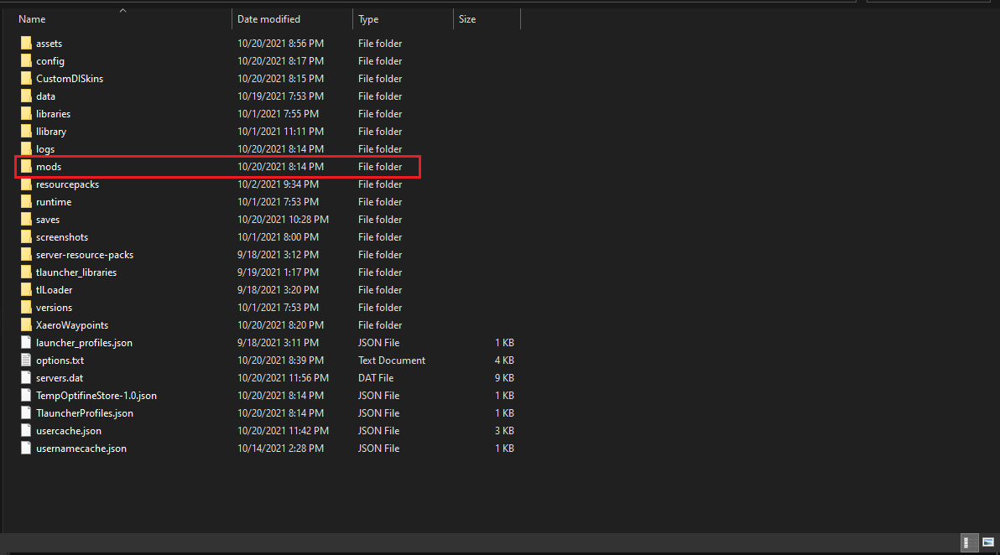
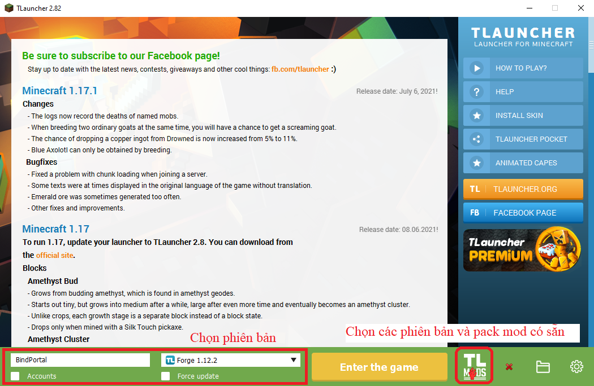
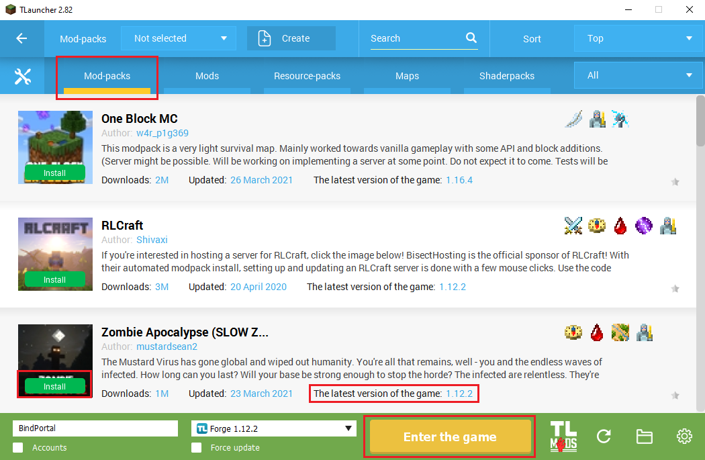

**Tới thời điểm hiện tại thì Minecraft đã có rất nhiều server với đủ thể loại mode, tuy nhiên để tương tác với nhiều người chơi đồng thời tối ưu chức năng cũng như phần lớn cho server thì họ thường sử dụng các phiên bản Vanila, Spigot, CraftBukkit và chạy plugins hay addons ko quá nặng, vậy còn các mod khác chẳn hạn như đi Dungoen, mở rộng Biome, một số chức năng khác mà Minecraft hường không có thì sao ???. thì buộc các bạn phải dựng dụng đết Minecraft Forge để chơi cũng như là lập Server, vậy nó là gì ?**

### 1. Minecraft Forge là gì ? ###

- Minecraft Forge là một file tiện ích ( hay cũng được hiểu là 1 file mở rộng mod ) có đuôi **`.jar`**, hỗ trợ người chơi cài đặt các bản mod khác của game với độ tương thích cao nhất. Minecraft Forge cung cấp cho người chơi tuỳ chọn cài đặt Server riêng dành cho game Minecraft và gửi lời mời cho những người chơi khác.

- Tuy nhiên không giống như các phiên bản Vanila, Spigot, CraftBukkit chỉ cần người chơi chọn đúng phiên bản minecraft mà server đang sử dụng là có thể vào được Server. Để có thể chơi Server Minecraft Forge thì buộc người chơi phải cài đúng phiên bản Minecraft Forge mà Server đang sự dụng đồng thời các mod riêng lẻ mà Server đang hoạt động.

### 2. Cài đặc và sử dụng Minecraft Forge. ###

**Cài đặt mod cho client**

Trước khi tải về và cài đặt Minecraft Forge hãy chắc chắn rằng bạn đã cài đặt JAVA vào máy, để kiểm tra máy tính của bạn đã có JAVA chỉ cần thao tác như sau: 

- Bật Command Prompt gõ lệnh **`java -version`** để kiểm tra phiên bản JAVA bạn đang sử dụng

- nếu máy tính bạn chưa có thì bạn có thể tại đây: [JAVA DOWNLOAD](https://www.java.com/en/download/manual.jsp)
- **Chú ý**: vui lòng xem và tải đúng phiên bản JAVA danh cho hệ điều hành bạn đang sử dụng.

Link các phiên bản Minecraft Forge dành cho Server cũng như Client: [Minecraft Forge](https://files.minecraftforge.net/net/minecraftforge/forge/)

Ví dụ: mình muốn chơi mod bản minecraft 1.12.2 thì mình sẽ tải forge 1.12.2 về:

Sau khi tải về bạn sẽ có được file setup mod như sau:

Đối với windows bạn chỉ cần click double chuột vào file trên setup thì sẽ mở được.

**Install Client**: Cài đặt Forge dành cho launcher minecraft bạn dùng, đầy cũng là phiên bản dành cho single player (người chơi đơn) bạn sẽ dùng bản này cài đặt để chơi 
**Install Server**: Cài đặt dành cho Server Minecraft, đây là phiên bản dành cho máy chủ và nhiều người truy cập chơi cùng

**Chú ý**: phần (The directory missing...) vì mình cài rồi nên nó sẽ báo lỗi, nếu các bạn chưa thì hoàn toàn sẽ không báo lỗi nhé, xong rồi bạn chỉ click OK hoặc Install nếu có đợi nó cài hoàn tất, sau đó bạn vào thư mục **.minecraft** để bỏ **mod** vào chơi thôi

Đây là các mod dành cho mọi phiên bản bạn có thể tham khảm và tải về [tại đây](https://www.9minecraft.net/tag/minecraft-1-12-2-mods/).

Nếu cách trên bạn cảm thấy khó khăn thì có thể tải [TLauncher](https://tlauncher.org/en/) này, nó được tích hợp mọi phiên bản minecraft bạn chỉ việc chọn vài cài đúng phiên bản Minecraft Forge bạn cần, ngoài ra nó cũng cho phép bạn lựa chọn các Pack Mod do người chơi tổng hợp.

**Cài đặt mod cho Server** Comming Soon update post
