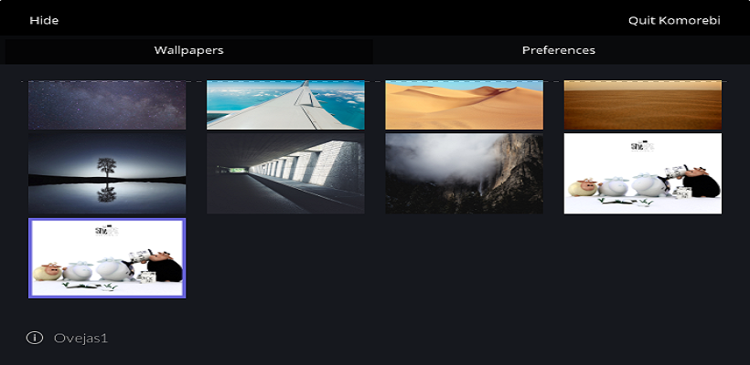
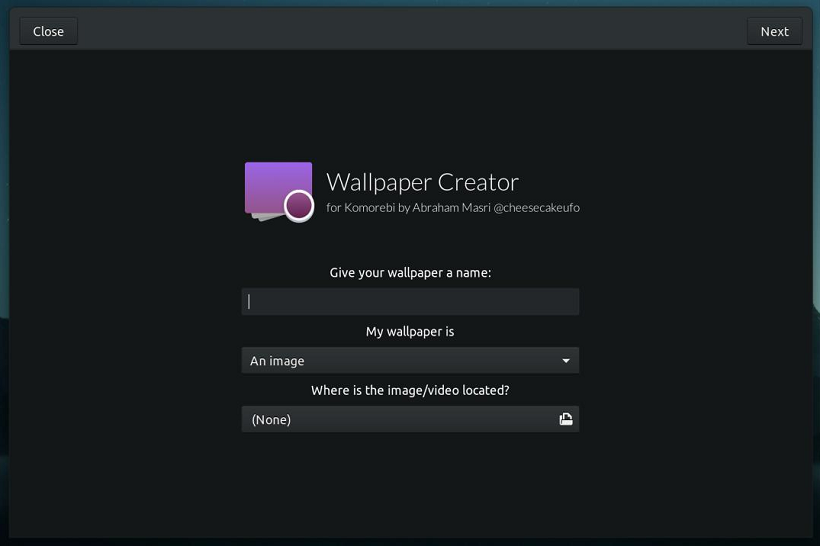
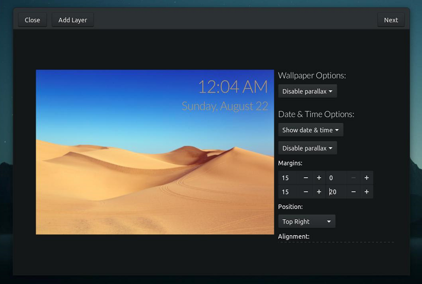
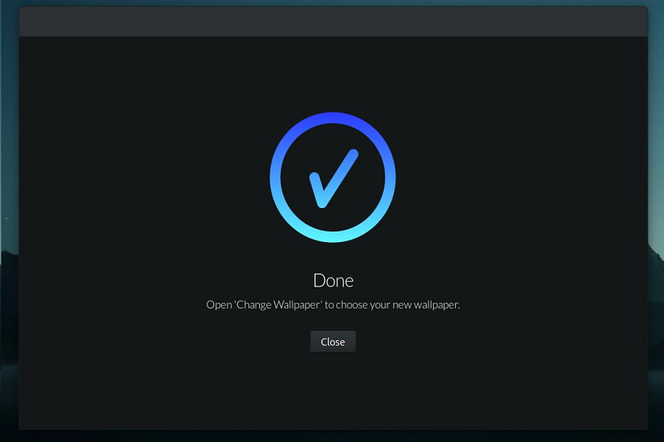

<center></center><br>
<br><br>
**Để có thể một hình nền động tuyệt đẹp trên desktop chạy hệ điều hành Windows của [Microssorft](https://www.microsoft.com/vi-vn) thì chúng ta phải có:** 

* [Wallpapper Engine](https://store.steampowered.com/app/431960/Wallpaper_Engine/) : Chú ý để có thể trải nghiệm tốt các tình năng có trên bộ cộng cụ này buộc các bạn phải trả phí mua trên Steam, hoặc bản có thể tải phiên bản crack [tại đây](https://linkneverdie.net/software/wallpaper-engine-6879).

* [Lively Wallpaper](https://www.microsoft.com/en-us/p/lively-wallpaper/9ntm2qc6qws7?activetab=pivot:overviewtab) : Bộ công cụ này được miễn phí trên Store của microssoft chạy trên Windows 10, nên các pc hay laptop nào đang sử dụng Windows 10 trở lên đều có thể cài được.

* [Push Video Wallpapper](https://taimienphi.vn/download-push-video-wallpaper-32846) : Tương tự như 2 bộ công cụ trên đó là dùng để làm ảnh động bằng video cho Desktop và hoàn toàn miễn phí.

Điều đặc biệt trên đó là tất cả phần mềm trên đều được hổ trợ trên Windows, vậy để có thể dùng video làm ảnh động trên các hệ điều hành khác chẳn hạn như HĐH Linux thì sao... ?. Tất nhiên là có thì mình mới viết bài này đăng cho các bạn xem chứ 😂 hihihi, luyên thuyên vậy đủ rồi mình vào chủ đề chính nhen, vậy nó là phần mềm **[Komorebi](https://github.com/cheesecakeufo/komorebi)**.<br><br>

### 1. Komorebi là gì ?
<hr>

**Komorebi** là một trình quản lý hình nền động tuyệt vời cho tất cả các nền tảng Linux. Nó cung cấp hình nền hình ảnh, video và trang web có thể tùy chỉnh hoàn toàn có thể được tinh chỉnh bất cứ lúc nào!

<center></center><br>

### 2. Cài đặt và sử dụng Komorebi.
<hr>

Mở **`Terminal`** lên bằng cách <kbd>Ctrl + Alt + t</kbd> và nhập lệnh sau:

**Cài đặt các gói cần thiết**

```console

 ~$ sudo add-apt-repository ppa:gnome3-team/gnome3 -y
 ~$ sudo add-apt-repository ppa:vala-team -y
 ~$ sudo add-apt-repository ppa:gnome3-team/gnome3-staging -y
 ~$ sudo apt install cmake valac libgtk-3-dev libgee-0.8-dev libclutter-gtk-1.0-dev libclutter-1.0-dev libwebkit2gtk-4.0-dev libclutter-gst-3.0-dev

```

**Cài đặt komorebi**

```console

 ~$ git clone https://github.com/cheesecakeufo/komorebi.git
 ~$ cd komorebi
 ~$ mkdir build && cd build
 ~$ cmake .. && sudo make install && ./komorebi

```

### 3. Custom video làm ảnh nền cho desktop
<hr>
Komorebi cung cấp một công cụ đơn giản để tạo hình nền của riêng bạn! Đơn giản, mở ứng dụng của bạn và tìm kiếm 'Trình tạo hình nền'.<br><br>

<center></center><br>
<center></center><br>
<center></center><br>

Bạn có thể sử dụng hình ảnh, video hoặc trang web làm hình nền và bạn có nhiều tùy chọn khác nhau để tùy chỉnh hình nền của riêng mình!

### 5. Gỡ bỏ komorebi.
<hr>

```console

 // Nếu bạn đã cài đặt phiên bản đóng gói của Komorebi
 ~$ sudo apt remove komorebi
 
 // Nếu bạn cài đặt thủ công Komorebi
 ~$ cd komorebi/build
 ~$ sudo make uninstall

```

Lời kết: Như vậy bạn đó có 1 hình nền desktop động tuyệt đẹp riêng cho chính mình, Bạn nào đã sử dụng rồi thì cho mình ý kiến nhá, và còn bộ công cụ nào hổ trợ làm ảnh động desktop cho linux nữa hay không thì các bạn chỉa sẽ cho mình và người khác cùng biết nhá.